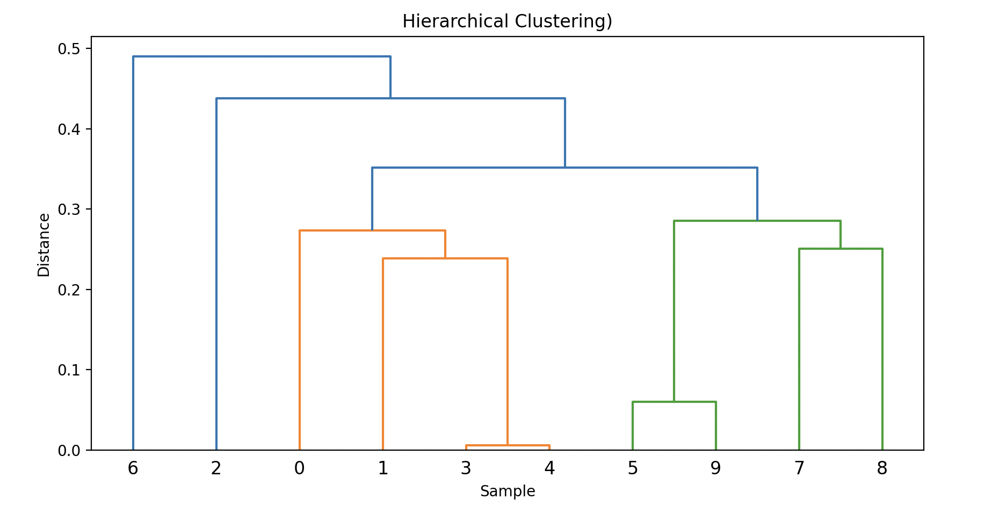
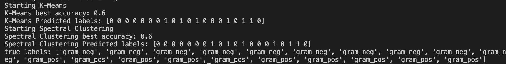

# MAT 180 HW3
## Diagram Clustering 

## Analysis
For the 20 random points I generated from the datasets, spectral and k-means clustering outputted the same predicted labels.

### Cluster 0:

Neg Hosts: 0,1,2,3,4,5,6,8 

Pos Hosts: 10,12,13,14,16,19 

### Cluster 1: 

Neg Hosts: 7,9

Pos Hosts: 11,15,17,18

### Do you see differences in the clusters produced by the different methods?
From the output, K-means and Spectral clustering output the same clusters, therefore we do not see a meaningful difference. This could be because the 20 sampled points are split obviously that makes clustering algorithms produce the same output. 

### Are gram positive and gram negative embeddings clustered together?
Yes, from my results we can assume they are mixed together. Cluster 0 contains 8 gram-neg and 6 gram-pos, while Cluster 1 contains 2 gram-neg and 4 gram-pos. 
The best accuracy is only 60%, suggesting the clusters are not separating gram-negative from gram-positive from my random sample.
Hierarchical clustering also suggests grouped structure with a couple of outliers, one gram-neg outlier and one gram-pos outlier,
but overall it still supports the conclusion that the two gram classes are not separated for this sample.
